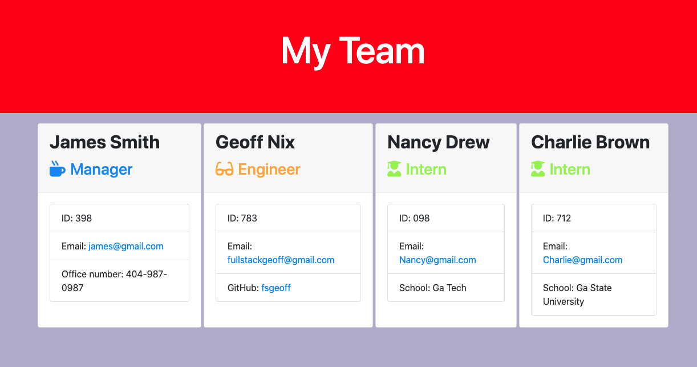
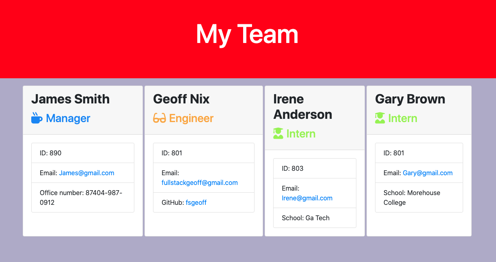
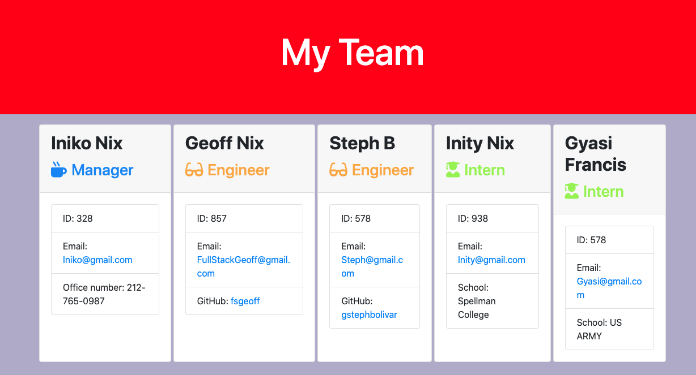

# Employee Template Engine

## Table of Contents

[Description](#description) 
[Packages](#packages) 
[Testing](#testing) 
[Demo](#demo) 
[Repository](#repository) 
[Screenshots](#screenshots) 
[Questions](#questions)

---

## Description

Node CLI that takes in information about employees and generates an HTML webpage that displays summaries for each person.   Each team consists of 1 **Manager**, and any given number of **Engineers** and **Interns**. Once all team members have been added, custom HTML cards are generated for the entire team that contain profiles of each individual team member **_based on their role._**

---

## Packages

1. package.JSON to keep track of node packages used(init -y)
2. jest (For testing purposes)

---

## Testing

The application can be tested by typing **'npm run test'** from the terminal of your computer. The application has been extensively tested and has passed 17 of 17 unit tests.

---

## Demo

Video demonstration of the[Unit Test](https://drive.google.com/file/d/1z8YCY-4Hc5aRc8QCLQ4OhH-ogaRlMLtu/view) 
Video demonstration of the [Application](https://drive.google.com/file/d/1jwDJuBmVknVWJhD-hSvVtYIFZ--4-mFZ/view)

---

## Repository

To view the commit history of the application please visit the
[Github Repo](http://github.com/fsgeoff)

---

## Screenshots

---

## Questions

Please feel free to contact me w/any questions concerning the application. 
Geoff Nix  
(347)727-1956 
FullStackGeoff@gmail.com
